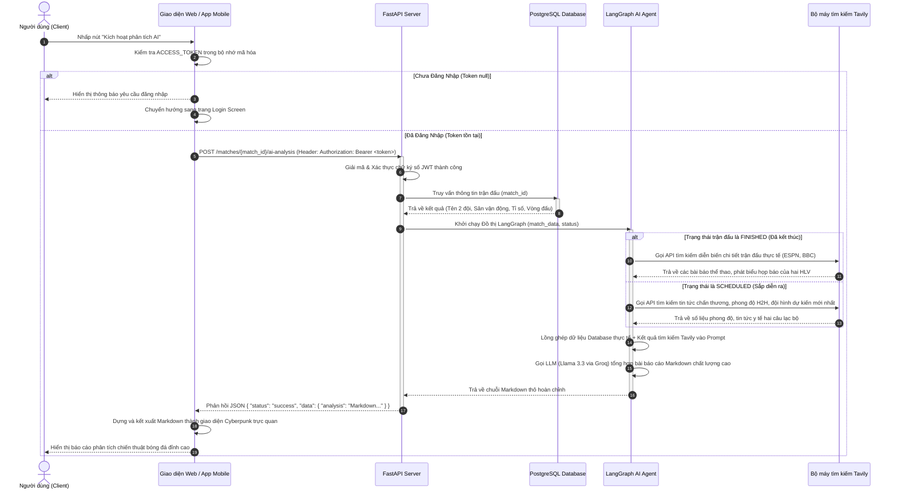

# BỘ GIÁO DỤC VÀ ĐÀO TẠO
## TRƯỜNG ĐẠI HỌC CÔNG NGHỆ THÔNG TIN VÀ TRUYỀN THÔNG VIỆT - HÀN (VKU)
---
<br>
<br>
<br>

# BÁO CÁO ĐỒ ÁN CƠ SỞ 3
## ĐỀ TÀI: NGHIÊN CỨU VÀ XÂY DỰNG HỆ THỐNG CẬP NHẬT KẾT QUẢ BÓNG ĐÁ TRỰC TUYẾN VÀ PHÂN TÍCH CHIẾN THUẬT NGOẠI HẠNG ANH THỜI GIAN THỰC SỬ DỤNG KIẾN TRÚC ĐA NỀN TẢNG (WEB, MOBILE NATIVE KOTLIN) VÀ CÔNG NGHỆ AI AGENT (LANGGRAPH & RAG)
<br>
<br>
<br>

### **Sinh viên thực hiện:**
1. **Đinh Nhật Cảm** - Lớp: 22GIT - MSSV: *(Sinh viên điền MSSV tại đây)*
2. **Trần Thị Bích** - Lớp: 22GIT - MSSV: *(Sinh viên điền MSSV tại đây)*

### **Giảng viên hướng dẫn:**
*   **ThS. Nguyễn Văn A** *(Sinh viên thay thế tên Giảng viên hướng dẫn thực tế tại đây)*

---
<br>
<br>
<br>
<center><b>ĐÀ NẴNG, NĂM 2026</b></center>

---
\pagebreak

# NHẬN XÉT CỦA GIẢNG VIÊN HƯỚNG DẪN
*Giảng viên ghi ý kiến nhận xét, đánh giá kết quả thực hiện đồ án của sinh viên Đinh Nhật Cảm và Trần Thị Bích về các mặt: Ý thức thái độ thực hiện, chất lượng báo cáo, tính ứng dụng thực tiễn, mức độ hoàn thành khối lượng công việc và điểm đánh giá chung.*

..................................................................................................................................................................................

..................................................................................................................................................................................

..................................................................................................................................................................................

..................................................................................................................................................................................

..................................................................................................................................................................................

..................................................................................................................................................................................

..................................................................................................................................................................................

..................................................................................................................................................................................

..................................................................................................................................................................................

..................................................................................................................................................................................

..................................................................................................................................................................................

..................................................................................................................................................................................

..................................................................................................................................................................................

..................................................................................................................................................................................

..................................................................................................................................................................................

..................................................................................................................................................................................

..................................................................................................................................................................................

<div align="right">
  <b>Đà Nẵng, ngày .... tháng .... năm 2026</b><br>
  <i>Giảng viên hướng dẫn (Ký và ghi rõ họ tên)</i>
</div>

---
\pagebreak

# LỜI CẢM ƠN
Lời đầu tiên, chúng em xin bày tỏ lòng biết ơn sâu sắc đến Ban Giám hiệu Trường Đại học Công nghệ Thông tin và Truyền thông Việt - Hàn (VKU) cùng toàn thể quý thầy cô giáo trong Khoa Khoa học Máy tính đã tạo điều kiện học tập tốt nhất, trang bị cho chúng em những nền tảng tri thức vững chắc và quý báu trong suốt quá trình theo học tại trường.

Đặc biệt, chúng em xin gửi lời cảm ơn chân thành và sâu sắc nhất đến thầy/cô **ThS. Nguyễn Văn A**, người đã trực tiếp định hướng đề tài, dành nhiều thời gian quý báu để hướng dẫn tận tình, chỉ bảo những thiếu sót và động viên chúng em vượt qua các rào cản kỹ thuật phức tạp để hoàn thiện đồ án này một cách tốt nhất.

Mặc dù đã có nhiều nỗ lực nghiên cứu, học hỏi và làm việc nghiêm túc, song đồ án chắc chắn không tránh khỏi những hạn chế và thiếu sót nhất định do giới hạn về mặt thời gian cũng như kinh nghiệm thực tiễn của nhóm. Chúng em rất mong nhận được những ý kiến đóng góp, nhận xét và phê bình quý báu từ quý thầy cô trong Hội đồng đánh giá để giúp chúng em hoàn thiện hơn năng lực chuyên môn của bản thân trên con đường sự nghiệp tương lai.

Chúng em xin chân thành cảm ơn!

<div align="right">
  <b>Sinh viên thực hiện:</b><br>
  <i>Đinh Nhật Cảm & Trần Thị Bích</i>
</div>

---
\pagebreak

# MỤC LỤC CHI TIẾT
1. [CHƯƠNG 1. GIỚI THIỆU ĐỀ TÀI](#chương-1-giới-thiệu-đề-tài)
   - 1.1 Giới thiệu tổng quan đề tài và bối cảnh nghiên cứu
   - 1.2 Lý do chọn đề tài và tính cấp thiết
   - 1.3 Mục tiêu của đề tài
     - 1.3.1 Mục tiêu tổng quát
     - 1.3.2 Mục tiêu cụ thể về mặt công nghệ và sản phẩm
   - 1.4 Phạm vi nghiên cứu và giới hạn của đề tài
     - 1.4.1 Đối tượng tác động và tập người dùng đích
     - 1.4.2 Các phân hệ chức năng cốt lõi
   - 1.5 Ý nghĩa thực tiễn và tính mới của đề tài
   - 1.6 Kiến trúc hệ thống tổng quát
   - 1.7 Các thách thức kỹ thuật lớn của hệ thống
2. [CHƯƠNG 2. NGHIÊN CỨU VÀ ĐÁNH GIÁ CÔNG NGHỆ SỬ DỤNG](#chương-2-nghiên-cứu-và-đánh-giá-công-nghệ-sử-dụng)
   - 2.1 Thư viện lập trình giao diện Web ReactJS
     - 2.1.1 Khái niệm cốt lõi và kiến trúc Component-based
     - 2.1.2 Ưu điểm về mặt hiệu năng hiển thị và tối ưu hóa DOM ảo
     - 2.1.3 Vai trò cụ thể trong hệ thống
   - 2.2 Framework thiết kế giao diện Tailwind CSS
     - 2.2.1 Triết lý Utility-First và cơ chế tối ưu hóa biên dịch JIT
     - 2.2.2 Ưu điểm trong thiết kế Responsive và thống nhất thiết kế
     - 2.2.3 Vai trò cụ thể trong hệ thống
   - 2.3 Ngôn ngữ lập trình và Công nghệ di động Kotlin Android
     - 2.3.1 Tổng quan về ngôn ngữ Kotlin và cơ chế Null Safety
     - 2.3.2 Jetpack Compose - Cuộc cách mạng trong phát triển giao diện Android
     - 2.3.3 Quản lý bất đồng bộ luồng với Kotlin Coroutines & Flow
     - 2.3.4 Vai trò cụ thể trong hệ thống
   - 2.4 Cổng API trung tâm hiệu năng cao FastAPI
     - 2.4.1 Khái niệm cốt lõi, ASGI và chuẩn xác thực dữ liệu Pydantic
     - 2.4.2 Ưu điểm về tốc độ phản hồi và tự động hóa tài liệu OpenAPI
     - 2.4.3 Vai trò cụ thể trong hệ thống
   - 2.5 Hệ quản trị cơ sở dữ liệu quan hệ PostgreSQL
     - 2.5.1 Tổng quan, tính tuân thủ ACID và độ tin cậy
     - 2.5.2 Vai trò cụ thể trong việc cấu trúc dữ liệu thể thao
   - 2.6 Nền tảng phát triển AI thế hệ mới LangChain và LangGraph
     - 2.6.1 LangChain - Khung kết nối Mô hình Ngôn ngữ Lớn
     - 2.6.2 LangGraph - Kiến trúc AI Agent có trạng thái và điều hướng tuần hoàn
     - 2.6.3 Vai trò cụ thể trong công cụ Phân tích chiến thuật tự động
3. [CHƯƠNG 3. PHÂN TÍCH VÀ THIẾT KẾ CHI TIẾT HỆ THỐNG](#chương-3-phân-tích-và-thiết-kế-chi-tiết-hệ-thống)
   - 3.1 Phân tích yêu cầu hệ thống tổng quát
   - 3.2 Yêu cầu chức năng chi tiết
     - 3.2.1 Phân hệ dành cho Khách vãng lai và Thành viên đăng ký
     - 3.2.2 Phân hệ dành cho Quản trị viên hệ thống (Admin Console)
   - 3.3 Yêu cầu phi chức năng chất lượng cao
     - 3.3.1 Hiệu năng phản hồi và tải trọng
     - 3.3.2 Tính bảo mật và mã hóa thông tin JWT
     - 3.3.3 Khả năng mở rộng kiến trúc ngang dọc
     - 3.3.4 Tính tương thích đa thiết bị và nền tảng
   - 3.4 Phân tích các tác nhân hệ thống chính
   - 3.5 Các biểu đồ phân tích và thiết kế hệ thống
     - 3.5.1 Biểu đồ Use Case tổng quát
     - 3.5.2 Biểu đồ tuần tự (Sequence Diagram) kích hoạt AI Analysis
     - 3.5.3 Biểu đồ thực thể liên kết ERD và cấu trúc bảng chi tiết
4. [CHƯƠNG 4. THIẾT KẾ VÀ HIỆN THỰC HÓA GIAO DIỆN WEBSITE VÀ MOBILE](#chương-4-thiết-kế-và-hiện-thực-hóa-giao-diện-website-và-mobile)
   - 4.1 Tổng quan về triết lý giao diện Dark Cyberpunk Terminal
   - 4.2 Hiện thực hóa giao diện Website (ReactJS + Tailwind CSS)
   - 4.3 Hiện thực hóa giao diện Mobile Android (Kotlin + Jetpack Compose)
   - 4.4 Đánh giá chất lượng giao diện người dùng
5. [CHƯƠNG 5. KẾT LUẬN VÀ HƯỚNG PHÁT TRIỂN TƯƠNG LAI](#chương-5-kết-luận-và-hướng-phát-triển-tương-lai)
   - 5.1 Đánh giá kết quả đạt được của đồ án
   - 5.2 Hạn chế kỹ thuật hiện tại
   - 5.3 Hướng phát triển và nâng cấp hệ thống
   - 5.4 Định hướng thương mại hóa sản phẩm thực tế
6. [TÀI LIỆU THAM KHẢO](#tài-liệu-tham-khảo)

---
\pagebreak

# CHƯƠNG 1. GIỚI THIỆU ĐỀ TÀI

## 1.1 Giới thiệu tổng quan đề tài và bối cảnh nghiên cứu
Sự bùng nổ của kỷ nguyên số và internet tốc độ cao đã thay đổi sâu sắc cách thức con người tiếp cận tri thức và thông tin giải trí. Trong lĩnh vực thể thao, đặc biệt là bóng đá, nhu cầu cập nhật tỉ số, dữ liệu thống kê trực tuyến đã trở thành một phần không thể thiếu trong đời sống tinh thần của hàng triệu người hâm mộ. Sự dịch chuyển từ các phương thức truyền thống như báo giấy, truyền hình sang các thiết bị số cầm tay thông minh đòi hỏi các hệ thống thông tin thể thao phải liên tục cải tiến về tốc độ cập nhật, sự tiện dụng trên nhiều nền tảng thiết bị, và đặc biệt là độ sâu của thông tin cung cấp.

Đề tài **"Xây dựng hệ thống cập nhật kết quả bóng đá trực tuyến và phân tích chiến thuật Ngoại Hạng Anh thời gian thực sử dụng kiến trúc đa nền tảng (Web, Mobile Native Kotlin) và công nghệ AI Agent (LangGraph & RAG)"** được thực hiện bởi nhóm sinh viên Đinh Nhật Cảm và Trần Thị Bích. Đề tài tập trung vào việc nghiên cứu và xây dựng một hệ thống tổng hợp thông tin bóng đá chất lượng cao, cung cấp số liệu livescore chuẩn xác của giải bóng đá Ngoại Hạng Anh (English Premier League - EPL). Điểm cốt lõi tạo nên sự khác biệt vượt trội của đề tài này so với các sản phẩm livescore hiện có trên thị trường là việc nghiên cứu tích hợp thành công kiến trúc **AI Agent** thế hệ mới dựa trên đồ thị trạng thái tuần hoàn LangGraph kết hợp với cơ chế **RAG (Retrieval-Augmented Generation)** để tự động hóa việc viết báo cáo chuyên sâu trước và sau trận đấu.

---

## 1.2 Lý do chọn đề tài và tính cấp thiết
Hiện nay, khi theo dõi giải đấu Ngoại Hạng Anh, người hâm mộ thường xuyên đối mặt với các vấn đề bất cập sau:
1.  **Sự phân mảnh thông tin**: Người hâm mộ phải mở đồng thời nhiều ứng dụng hoặc trang web khác nhau: một trang để cập nhật livescore thô (như FlashScore, SofaScore), một ứng dụng mạng xã hội để đọc tin chuyển nhượng, và các trang báo điện tử thể thao lớn (BBC Sport, ESPN, Sky Sports) để tìm kiếm các bài phân tích chiến thuật của chuyên gia.
2.  **Rào cản chi phí đối với thông tin chuyên sâu**: Các bài viết nhận định sâu sắc về sơ đồ chiến thuật (Tactical Board), phân tích chuyển dịch cự ly đội hình, đánh giá chuyên môn sâu của huấn luyện viên thường nằm sau các bức tường phí (paywalls) của các tờ báo cao cấp như *The Athletic*, hoặc xuất hiện rất muộn sau khi trận đấu đã kết thúc nhiều ngày.
3.  **Hạn chế cố hữu của công nghệ AI truyền thống**: Người hâm mộ có xu hướng sử dụng các chatbot AI (như ChatGPT, Gemini) để hỏi về kết quả trận đấu hoặc nhận định trận đấu. Tuy nhiên, do giới hạn về mốc tri thức huấn luyện (knowledge cutoff), các LLM này hoàn toàn bị mù thông tin thời gian thực. Nếu bị ép buộc trả lời, LLM sẽ sinh ra hiện tượng **ảo giác (hallucination)** - bịa đặt ra tỉ số, người ghi bàn hoặc thông tin chấn thương sai lệch hoàn toàn so với thực tế.
4.  **Tính cấp thiết của đề tài**: Cần thiết phải xây dựng một giải pháp kỹ thuật có khả năng kết nối trực tiếp dữ liệu thô từ cơ sở dữ liệu bóng đá thực tế, chuyển hóa thông tin này làm neo tri thức (Fact Grounding) để điều khiển một tác nhân AI Agent thông minh. AI Agent này sẽ tự động tìm kiếm, xác thực và tổng hợp tin tức họp báo, thông tin bên lề uy tín trên Internet thời gian thực để xuất bản ra những báo cáo chiến thuật bóng đá hoàn toàn chính xác, sâu sắc và tức thời dưới dạng ngôn ngữ tự nhiên. 

---

## 1.3 Mục tiêu của đề tài

### 1.3.1 Mục tiêu tổng quát
Nghiên cứu lý thuyết và hiện thực hóa thành công một hệ sinh thái livescore đa nền tảng toàn diện, hoạt động ổn định trên môi trường Web ứng dụng ReactJS và ứng dụng di động Native Android Kotlin. Hệ thống được quản trị tập trung bởi cổng FastAPI backend hiệu năng cao, kết nối trực tiếp cơ sở dữ liệu PostgreSQL cục bộ được đồng bộ tự động với đối tác API thể thao quốc tế và tích hợp phân hệ trí tuệ nhân tạo AI Agent LangGraph tự động sinh báo cáo bóng đá.

### 1.3.2 Mục tiêu cụ thể về mặt công nghệ và sản phẩm
*   **Về mặt dữ liệu**: Thiết kế cấu hình cơ sở dữ liệu chuẩn hóa, lưu trữ toàn bộ hồ sơ chi tiết của 20 câu lạc bộ giải EPL, danh sách hàng trăm cầu thủ đang thi đấu, bảng xếp hạng cập nhật liên tục sau mỗi vòng đấu và dữ liệu lịch sử của 380 trận đấu trong mùa giải.
*   **Về mặt kiến trúc AI**: Xây dựng một đồ thị LangGraph Agentic có trạng thái hoàn chỉnh, phân biệt rõ ràng hai luồng nghiệp vụ RAG:
    *   *Đối với các trận đấu sắp diễn ra (SCHEDULED)*: Tự động thu thập dữ liệu chấn thương mới nhất, lịch sử đối đầu H2H, dự báo thời tiết tại sân vận động và dự đoán sơ đồ chiến thuật ra sân dự kiến (Expected Lineups).
    *   *Đối với các trận đấu đã kết thúc (FINISHED)*: Tự động trích xuất các mốc sự kiện ghi bàn, thẻ phạt từ cơ sở dữ liệu, tìm kiếm các phát biểu họp báo chính thức của hai huấn luyện viên trưởng và các thông tin bên lề (Trivia) thú vị xung quanh trận đấu.
*   **Về mặt hiển thị và trải nghiệm người dùng**:
    *   Xây dựng giao diện Web theo chuẩn responsive, áp dụng thiết kế Dark Cyberpunk độc đáo với hiệu ứng viền phát sáng neon tạo cảm giác công nghệ cao.
    *   Phát triển ứng dụng Android native bằng Jetpack Compose, quản lý phiên đăng nhập và bảo mật các dữ liệu cá nhân thông qua cơ chế mã hóa JWT (JSON Web Token) kết hợp cùng OkHttp Interceptors đính kèm header tự động.
    *   Kết xuất hoàn hảo nội dung phân tích dạng Markdown thô nhận được từ AI thành giao diện hiển thị cấu trúc khoa học, trực quan trên cả Web và Di động.

---

## 1.4 Phạm vi nghiên cứu và giới hạn của đề tài

### 1.4.1 Đối tượng tác động và tập người dùng đích
*   **Người dùng vãng lai (Guest)**: Tập khán giả đại chúng có nhu cầu cập nhật nhanh tỉ số trực tuyến, lịch thi đấu, bảng xếp hạng và tra cứu danh sách cầu thủ. Nhóm này được quyền truy cập toàn bộ các dữ liệu công khai trên hệ thống.
*   **Thành viên chính thức (Authenticated User)**: Những người hâm mộ trung thành có tài khoản hợp lệ. Nhóm này được hệ thống mở khóa quyền hạn sử dụng phân hệ AI Agent để yêu cầu phân tích trận đấu chuyên sâu, đồng thời có quyền tùy biến đánh dấu "Đội bóng yêu thích" để hệ thống ưu tiên ghim lên đầu bảng tin.
*   **Quản trị viên (Administrator)**: Đội ngũ kỹ thuật vận hành hệ thống. Admin có quyền truy cập bảng điều khiển bảo mật để cấu hình các tham số AI, giám sát hệ thống nhật ký hoạt động, và ra lệnh đồng bộ thủ công dữ liệu từ máy chủ API quốc tế.

### 1.4.2 Các phân hệ chức năng cốt lõi
*   **Phân hệ đồng bộ hóa dữ liệu (Background Sync Worker)**: Tiến trình ngầm định kỳ gọi API bóng đá quốc tế v4 để nạp dữ liệu mới vào PostgreSQL.
*   **Phân hệ xác thực bảo mật (Auth Service)**: Quản lý đăng ký tài khoản, băm mật khẩu một chiều nâng cao và phân phối/kiểm duyệt mã khóa JWT Token.
*   **Phân hệ AI RAG Engine**: Đồ thị LangGraph kết nối mô hình Llama 3.3 (qua Groq API) và bộ máy tìm kiếm Tavily API để xuất bản báo cáo chiến thuật dạng Markdown.
*   **Phân hệ hiển thị đa nền tảng**: Ứng dụng Web SPA (ReactJS) và ứng dụng di động Native Android (Kotlin).

---

## 1.5 Ý nghĩa thực tiễn và tính mới của đề tài
*   **Tính mới về mặt công nghệ**: Đồ án này là một trong những công trình tiên phong tại khoa ứng dụng thành công **kiến trúc Agentic Workflow** của LangGraph vào bài toán xử lý thông tin thời gian thực động. Thay vì sử dụng cơ chế RAG tĩnh (chỉ tìm kiếm trong tài liệu PDF có sẵn), AI Agent của hệ thống có khả năng tự động tối ưu hóa từ khóa tìm kiếm dựa trên dữ liệu database thô và chủ động truy vấn Internet để thu thập tri thức mới nhất trước khi tổng hợp.
*   **Ý nghĩa thực tiễn**: Dự án mang lại một giải pháp thay thế hoàn hảo cho các trang tin thể thao truyền thống. Giao diện Cyberpunk tạo ra một làn gió mới về mặt trải nghiệm thị giác cho giới trẻ yêu công nghệ, đồng thời cung cấp các bài phân tích chiến thuật miễn phí nhưng có độ sâu chuyên môn tương đương các trang báo có phí cao cấp.

---

## 1.6 Kiến trúc hệ thống tổng quát
Hệ thống được tổ chức vận hành theo kiến trúc 3 tầng (Three-Tier Architecture) giúp phân tách rõ ràng trách nhiệm của từng phần, nâng cao tính bảo mật và khả năng bảo trì:

```
+-------------------------------------------------------------------------------+
|                        KIẾN TRÚC HỆ THỐNG PHÂN TẦNG CỰC BỘ                     |
+-------------------------------------------------------------------------------+
|                                                                               |
|   +---------------------------------+     +-------------------------------+   |
|   |         TẦNG TRÌNH DIỄN         |     |        TẦNG TRÌNH DIỄN        |   |
|   |  Giao diện Web SPA (ReactJS)    |     |  App Di động Native (Kotlin)  |   |
|   +---------------------------------+     +-------------------------------+   |
|                   ^                                       ^                   |
|                   | HTTP REST Request (JSON Payload)      |                   |
|                   +-------------------+   +---------------+                   |
|                                       |   |                                   |
|                                       v   v                                   |
|   +-----------------------------------------------------------------------+   |
|   |                          TẦNG LOGIC NGHIỆP VỤ                         |   |
|   |        FastAPI Web Server (Xác thực JWT / Xử lý ASGI / Router)        |   |
|   +-----------------------------------------------------------------------+   |
|        |                               |                              |       |
|        | Đọc/Ghi Dữ liệu               | Kích hoạt Đồ thị             | Sync  |
|        v                               v                              v       |
|   +---------------+            +---------------+              +------------+  |
|   | TẦNG DỮ LIỆU  |            | PHÂN HỆ AI AGENT              | FOOTBALL   |  |
|   |  PostgreSQL   |            |  LangGraph +  |              | API V4     |  |
|   |   Database    |            | Llama 3.3 LLM |              | (External) |  |
|   +---------------+            +---------------+              +------------+  |
|                                        |                              |       |
|                                        v Truy vấn                     |       |
|                                +---------------+                      |       |
|                                | Tavily Search |                      |       |
|                                +---------------+                      |       |
|                                                                               |
+-------------------------------------------------------------------------------+
```

-Thêm ảnh ở đây-

*Hình 1.2: Sơ đồ luồng dữ liệu kiến trúc hệ thống 3 tầng kết nối đa nền tảng và AI Agent*

Tầng trình diễn độc lập gửi các yêu cầu HTTP RESTful chứa dữ liệu JSON đến tầng logic nghiệp vụ FastAPI. FastAPI chịu trách nhiệm giao tiếp với PostgreSQL thông qua SQLAlchemy ORM để truy xuất dữ liệu livescore. Khi nhận được tín hiệu yêu cầu phân tích trận đấu từ thành viên đã xác thực bằng JWT, FastAPI sẽ khởi chạy quy trình Agentic RAG trên LangGraph để lấy dữ liệu trận đấu làm neo, gọi Tavily API tìm kiếm tin tức trên Internet và đưa prompt sạch vào Llama 3.3 để sinh báo cáo trả về Client hiển thị.

---

## 1.7 Các thách thức kỹ thuật lớn của hệ thống
Nhóm sinh viên Đinh Nhật Cảm và Trần Thị Bích đã đối mặt và giải quyết thành công ba rào cản công nghệ lớn:
1.  **Hạn chế nghiêm trọng của nguồn cung cấp dữ liệu**: Gói miễn phí của đối tác dữ liệu thể thao quốc tế chỉ cho phép gọi 10 yêu cầu/phút và hoàn toàn ẩn đi các trường sự kiện chi tiết của trận đấu (bàn thắng, thẻ phạt, thay người). Nhóm đã thiết kế một giải pháp lai: PostgreSQL vẫn lưu trữ các dữ liệu thô tối thiểu. Khi trận đấu kết thúc, AI Agent sẽ đóng vai trò là "công cụ cào dữ liệu thông minh" – tự động tìm kiếm báo cáo trận đấu chi tiết của ESPN/BBC và tự động biên dịch cấu trúc bàn thắng, thẻ phạt để bù đắp vào phần thiếu hụt dữ liệu thô.
2.  **Độ trễ và xử lý nghẽn mạng trên thiết bị di động**: Việc gọi mô hình AI sinh báo cáo có thể mất từ 5-8 giây. Nhóm đã tối ưu trải nghiệm người dùng di động bằng cách sử dụng **Kotlin Coroutines** để đẩy tiến trình tải dữ liệu này xuống luồng phụ chạy ẩn, đồng thời hiển thị màn hình chờ tải (Shimmer loading skeleton) mang hiệu ứng Cyberpunk nhấp nháy, giúp người dùng không cảm thấy ứng dụng bị đơ cứng.
3.  **Xác thực chéo và bảo mật Endpoint**: Đảm bảo các API phân tích AI đắt đỏ không bị lạm dụng bởi người dùng chưa đăng nhập. Nhóm lập trình một hệ thống OkHttp Interceptor trên Android tự động giải mã JWT, kiểm tra thời hạn sử dụng mã khóa ngay tại Client trước khi gửi request. Nếu token hết hạn hoặc không tồn tại, Client sẽ chặn đứng hành vi gửi request và thực hiện chuyển hướng người dùng an toàn sang trang đăng nhập.

---
\pagebreak

# CHƯƠNG 2. NGHIÊN CỨU VÀ ĐÁNH GIÁ CÔNG NGHỆ SỬ DỤNG

## 2.1 Thư viện lập trình giao diện Web ReactJS

### 2.1.1 Khái niệm cốt lõi và kiến trúc Component-based
ReactJS là một thư viện JavaScript mã nguồn mở được Meta phát triển nhằm tối ưu hóa việc xây dựng giao diện người dùng động. Điểm cốt lõi trong triết lý thiết kế của React là kiến trúc **Component-based**. Thay vì viết mã HTML và CSS thành các file tài liệu tĩnh dài hàng ngàn dòng, React chia nhỏ giao diện thành các khối độc lập (Component) có khả năng tự quản lý trạng thái hiển thị riêng biệt. Mỗi component trong React nhận dữ liệu đầu vào qua `props` và tự duy trì trạng thái nội bộ bằng `state`.

```
           +----------------------------------+
           |        Root App Component        |
           +----------------------------------+
                            |
         +------------------+------------------+
         |                                     |
+------------------+                  +------------------+
| Navigation Bar   |                  | Main Container   |
+------------------+                  +------------------+
                                               |
                                     +---------+---------+
                                     |                   |
                            +------------------+ +------------------+
                            | Match List Card  | | Standing Table   |
                            +------------------+ +------------------+
```

### 2.1.2 Ưu điểm về mặt hiệu năng hiển thị và tối ưu hóa DOM ảo
*   **Virtual DOM (DOM ảo)**: Thao tác trực tiếp trên DOM thực của trình duyệt là một tác vụ cực kỳ đắt đỏ về hiệu năng phần cứng. React giải quyết triệt để vấn đề này bằng cách duy trì một bản sao DOM ảo siêu nhẹ trong bộ nhớ RAM. Khi có bất kỳ sự thay đổi trạng thái nào, React sẽ cập nhật cây DOM ảo trước.
*   **Cơ chế Reconciliation (Đối sánh khác biệt)**: React sử dụng thuật toán so sánh Diffing để đối chiếu cây DOM ảo mới và cũ. Sau khi tìm ra điểm khác biệt nhỏ nhất, nó chỉ ra lệnh cho trình duyệt vẽ lại đúng các phần tử giao diện thực sự thay đổi. Điều này giúp tối ưu hóa hiệu năng render, đem lại trải nghiệm ứng dụng Web mượt mà tương đương phần mềm di động native.
*   **Mô hình luồng dữ liệu một chiều (One-Way Data Binding)**: Dữ liệu luôn truyền từ cha xuống con thông qua `props`, giúp dễ dàng cô lập lỗi và gỡ lỗi hệ thống khi phát sinh sự cố trạng thái.

### 2.1.3 Vai trò cụ thể trong hệ thống
ReactJS được nhóm sử dụng để làm nền tảng cốt lõi phát triển giao diện Web EPL Livescore. Tận dụng cơ chế hooks hiện đại (`useState` để lưu thông tin trạng thái trận đấu, `useEffect` để bắt sự kiện thay đổi vòng đấu và thực hiện gọi API tự động), nhóm đã xây dựng một nền tảng Web đơn trang hoạt động ổn định, có tốc độ phản hồi chuyển trang gần như ngay lập tức mà không phải tải lại toàn bộ trang web.

---

## 2.2 Framework thiết kế giao diện Tailwind CSS

### 2.2.1 Triết lý Utility-First và cơ chế tối ưu hóa biên dịch JIT
Tailwind CSS là một framework CSS đột phá hoạt động theo triết lý **Utility-First**. Thay vì ép buộc lập trình viên sử dụng các component định hình sẵn kiểu dáng như Bootstrap, Tailwind cung cấp hàng ngàn lớp tiện ích (utility classes) đơn giản, mỗi lớp đảm nhiệm một thuộc tính định dạng CSS duy nhất. 

Đặc biệt, từ phiên bản 3.0, Tailwind tích hợp bộ máy biên dịch **JIT (Just-in-Time)**. JIT liên tục quét toàn bộ các tệp tin mã nguồn phát triển và chỉ thực hiện biên dịch ra file CSS thành phẩm chứa đúng các class thực sự xuất hiện trong code.

### 2.2.2 Ưu điểm trong thiết kế Responsive và thống nhất thiết kế
*   **Tốc độ lập trình nhanh**: Lập trình viên có thể tùy biến kiểu dáng linh hoạt trực tiếp trong mã JSX của component mà không cần chuyển đổi qua lại giữa các tệp tin CSS và cấu trúc class rườm rà.
*   **Thiết kế thích ứng dễ dàng**: Tailwind tích hợp sẵn các tiền tố thiết bị trực quan như `sm:`, `md:`, `lg:`, `xl:`. Lập trình viên dễ dàng định nghĩa bố cục màn hình:
    ```jsx
    <div className="grid grid-cols-1 md:grid-cols-2 lg:grid-cols-4 gap-4">
      {/* Tự động chuyển đổi từ 1 cột trên điện thoại thành 4 cột trên màn hình máy tính */}
    </div>
    ```
*   **Thống nhất hệ thống Design System**: Cho phép cấu hình các giá trị màu sắc, phông chữ, khoảng cách cố định trong tệp `tailwind.config.js` để áp dụng đồng bộ trên toàn bộ dự án.

### 2.2.3 Vai trò cụ thể trong hệ thống
Tailwind CSS là công cụ đắc lực giúp nhóm Đinh Nhật Cảm và Trần Thị Bích hiện thực hóa giao diện mang phong cách **Dark Cyberpunk**. Các nhà thiết kế đã tùy biến cấu hình hệ màu sắc độc quyền trong tệp cấu hình:

```javascript
// Trích cấu hình tailwind.config.js tùy biến hệ màu Cyberpunk của dự án
module.exports = {
  theme: {
    extend: {
      colors: {
        'cyber-dark': '#0D0F12',
        'cyber-card': '#13171E',
        'cyber-green': '#00FF66',
        'cyber-blue': '#00D2FF',
        'cyber-red': '#FF453A',
      },
      fontFamily: {
        monospace: ['JetBrains Mono', 'Courier New', 'monospace'],
      }
    },
  },
}
```

Nhờ cấu hình này, nhóm dễ dàng viết các class như `bg-cyber-dark`, `border-cyber-green/20`, `text-cyber-blue` trực tiếp trong React JSX để tạo ra các hiệu ứng phát sáng neon và thiết kế giao diện đồng bộ.

---

## 2.3 Ngôn ngữ lập trình và Công nghệ di động Kotlin Android

### 2.3.1 Tổng quan về ngôn ngữ Kotlin và cơ chế Null Safety
Kotlin là ngôn ngữ lập trình kiểu tĩnh (statically typed), hiện đại, chạy trên máy ảo Java (JVM) và được Google chỉ định là ngôn ngữ ưu tiên hàng đầu để phát triển ứng dụng di động Android. Kotlin khắc phục toàn bộ các hạn chế dài dòng và thiếu an toàn của Java cũ. 

Tính năng đắt giá nhất của Kotlin là hệ thống **Null Safety** được tích hợp thẳng vào trình biên dịch. Ngôn ngữ phân biệt rõ ràng giữa kiểu dữ liệu có thể chứa giá trị Null (định nghĩa bằng dấu chấm hỏi như `String?`) và kiểu không được chứa Null (`String`). Cơ chế này giúp loại bỏ hoàn toàn lỗi sập app kinh điển `NullPointerException` trong quá trình vận hành thiết bị.

### 2.3.2 Jetpack Compose - Cuộc cách mạng trong phát triển giao diện Android
Jetpack Compose là bộ công cụ phát triển giao diện người dùng di động theo mô hình khai báo (Declarative UI) thay thế cho việc thiết kế layout bằng tệp tin XML truyền thống. Lập trình viên định nghĩa giao diện bằng cách viết các hàm Kotlin thông thường được đánh dấu annotation `@Composable`. Khi trạng thái dữ liệu (State) thay đổi, Jetpack Compose sẽ tự động chạy lại tiến trình Recomposition để cập nhật lại những phần giao diện bị ảnh hưởng với hiệu năng tối ưu nhất.

### 2.3.3 Quản lý bất đồng bộ luồng với Kotlin Coroutines & Flow
Việc gọi API qua internet và đọc cơ sở dữ liệu di động là các tác vụ gây nghẽn luồng xử lý giao diện chính (UI Thread). Kotlin giải quyết triệt để vấn đề này bằng **Coroutines** - cơ chế xử lý đa luồng siêu nhẹ (Lightweight threads). Kết hợp với **Flow** (luồng dữ liệu bất đồng bộ phát ra nhiều giá trị theo thời gian), hệ thống di động có khả năng thiết lập các kênh polling tự động kéo kết quả tỉ số livescore mới từ FastAPI Backend về máy sau mỗi 30 giây cực kỳ mượt mà.

### 2.3.4 Vai trò cụ thể trong hệ thống
Kotlin cùng Jetpack Compose được nhóm sử dụng để xây dựng ứng dụng native Android. Ứng dụng tích hợp thư viện Retrofit và OkHttpClient để giao tiếp với FastAPI. Việc sử dụng Jetpack Compose giúp nhóm dễ dàng dựng các Composable tùy biến phong cách Cyberpunk như bảng kết quả bóng đá, bảng xếp hạng 20 đội bóng có thể cuộn vuốt tốc độ cao mà không bị giật lag phần cứng.

---

## 2.4 Cổng API trung tâm hiệu năng cao FastAPI

### 2.4.1 Khái niệm cốt lõi, ASGI và chuẩn xác thực dữ liệu Pydantic
FastAPI là một web framework mã nguồn mở viết bằng Python chuyên dùng để thiết kế các dịch vụ Web API tốc độ cao. FastAPI hoạt động dựa trên tiêu chuẩn **ASGI (Asynchronous Server Gateway Interface)**, cho phép xử lý đồng thời hàng ngàn kết nối bất đồng bộ thực thụ nhờ cơ chế `async`/`await` của Python. 

FastAPI tích hợp sâu thư viện **Pydantic** để quản lý và định nghĩa các mô hình dữ liệu (Data Schemas). Pydantic đảm nhận việc tự động kiểm tra kiểu dữ liệu của JSON payload gửi lên từ client, tự động chuyển đổi định dạng và trả về mã lỗi 422 chi tiết nếu dữ liệu không tương thích, bảo vệ tuyệt đối sự ổn định của backend.

### 2.4.2 Ưu điểm về tốc độ phản hồi và tự động hóa tài liệu OpenAPI
*   **Hiệu năng vượt trội**: Nhờ Starlette và Uvicorn làm nền tảng, FastAPI cho tốc độ xử lý ngang ngửa với các framework backend nổi tiếng về hiệu năng như NodeJS (Express) và Go.
*   **Tự động tạo tài liệu tương tác**: Chỉ cần viết mã code Python tiêu chuẩn, FastAPI sẽ tự động sinh ra hai trang tài liệu hướng dẫn sử dụng API tương tác thời gian thực là Swagger UI (tại đường dẫn `/docs`) và ReDoc (tại `/redoc`) tuân thủ nghiêm ngặt chuẩn OpenAPI. Điều này giúp nhóm thiết kế Frontend Web và Mobile dễ dàng thử nghiệm API mà không cần viết tài liệu hướng dẫn thủ công.

### 2.4.3 Vai trò cụ thể trong hệ thống
FastAPI là cổng kết nối trung tâm của toàn bộ đồ án. Nó điều phối các truy vấn dữ liệu từ database PostgreSQL thông qua SQLAlchemy ORM, vận hành tiến trình ngầm đồng bộ tự động `Sync Worker`, quản lý cơ chế xác thực JWT bảo mật và cung cấp cổng kết nối kích hoạt đồ thị AI Agent LangGraph để xuất bản phân tích chiến thuật Ngoại Hạng Anh.

---

## 2.5 Hệ quản trị cơ sở dữ liệu quan hệ PostgreSQL

### 2.5.1 Tổng quan, tính tuân thủ ACID và độ tin cậy
PostgreSQL là hệ quản trị cơ sở dữ liệu quan hệ đối tượng (ORDBMS) mã nguồn mở tiên tiến nhất thế giới. PostgreSQL nổi tiếng toàn cầu về tính ổn định vững chắc, khả năng chịu tải cực cao và tuân thủ nghiêm ngặt các tiêu chuẩn **ACID** (Atomicity, Consistency, Isolation, Durability) đảm bảo mọi giao dịch cơ sở dữ liệu luôn diễn ra an toàn, chính xác và không bị hư hại cấu trúc dữ liệu ngay cả khi hệ thống mất điện đột ngột.

### 2.5.2 Vai trò cụ thể trong việc cấu trúc dữ liệu thể thao
Trong đồ án này, PostgreSQL lưu trữ có cấu trúc toàn bộ dữ liệu của giải đấu Premier League. Hệ thống sử dụng thư viện SQLAlchemy trong Python để cấu hình mô hình ORM (Object-Relational Mapping), tự động ánh xạ cấu trúc bảng quan hệ thành các Class Python tiện dụng. 

Các quan hệ khóa ngoại (Foreign Keys) được định nghĩa chặt chẽ với cơ chế xóa dây chuyền `ondelete="CASCADE"` giúp duy trì tính toàn vẹn tham chiếu dữ liệu. Ví dụ, khi một trận đấu bị xóa, các sự kiện chi tiết liên quan đến bàn thắng của trận đó sẽ được PostgreSQL tự động dọn dẹp sạch sẽ, giữ cho hệ thống luôn gọn nhẹ, tối ưu.

---

## 2.6 Nền tảng phát triển AI thế hệ mới LangChain và LangGraph

### 2.6.1 LangChain - Khung kết nối Mô hình Ngôn ngữ Lớn
LangChain là một khung thư viện lập trình (Framework) giúp đơn giản hóa tối đa việc xây dựng các ứng dụng tích hợp mô hình ngôn ngữ lớn (LLM). Nó cung cấp các module chuẩn hóa để quản lý prompt (Prompt Templates), kết nối nhiều mô hình AI khác nhau (Groq, OpenAI, Gemini), liên kết các chuỗi xử lý nghiệp vụ tuyến tính và tích hợp các bộ công cụ truy xuất dữ liệu ngoài (Retrieval-Augmented Generation - RAG).

### 2.6.2 LangGraph - Kiến trúc AI Agent có trạng thái và điều hướng tuần hoàn
Các chuỗi tuyến tính truyền thống của LangChain (như `Chain`) chỉ cho phép dữ liệu đi theo một chiều cố định từ đầu đến cuối và không thể quay lui hay rẽ nhánh có điều kiện. **LangGraph** ra đời để giải quyết triệt để rào cản này. LangGraph định nghĩa quy trình xử lý của AI dưới dạng một đồ thị có trạng thái (**Stateful Graph**). 

Mỗi hành động của AI được định nghĩa là một Node (Nút), các chuyển tiếp giữa các hành động là các Edges (Cạnh). Trạng thái của hệ thống (`AgentState`) liên tục được cập nhật và truyền qua các Node. LangGraph cho phép thiết lập các cạnh điều kiện (Conditional Edges) cho phép AI Agent tự đánh giá kết quả đầu ra của Node trước để quyết định rẽ nhánh nghiệp vụ thích hợp, hoặc lặp đi lặp lại một tác vụ tìm kiếm cho đến khi đạt được kết quả chuẩn xác mới thôi.

```
       +------------------------------------+
       |               START                |
       +------------------------------------+
                         |
                         v
       +------------------------------------+
       |         fetch_match_data           |
       +------------------------------------+
                         |
                         | (Trạng thái trận đấu?)
                         v
             /-----------------------\
            < status_routing (Edge)   >
             \-----------------------/
            /                         \
 (FINISHED) /                           \ (SCHEDULED)
           v                             v
+-----------------------------+   +-----------------------------+
|   search_finished_reports   |   |    search_upcoming_stats    |
+-----------------------------+   +-----------------------------+
           |                                     |
           v                                     v
+-----------------------------+   +-----------------------------+
|  summarize_finished_match   |   |   analyze_upcoming_match    |
+-----------------------------+   +-----------------------------+
           \                                     /
            \                                   /
             +---------> respond_to_user <-----+
                                 |
                                 v
                              [ END ]
```

### 2.6.3 Vai trò cụ thể trong công cụ Phân tích chiến thuật tự động
Trong đồ án này, LangGraph đóng vai trò làm bộ tổng chỉ huy cho phân hệ AI. Khi người dùng gửi yêu cầu phân tích trận đấu, FastAPI kích hoạt đồ thị LangGraph được biên dịch sẵn. Đồ thị điều phối luồng dữ liệu như sau:
1.  **fetch_match_data (Node)**: Truy vấn PostgreSQL để lấy thông tin cốt lõi (tên đội bóng, sân vận động, tỉ số).
2.  **status_routing (Conditional Edge)**: Kiểm tra trạng thái trận đấu.
    *   Nếu trận đấu đã kết thúc: Chuyển hướng sang node `search_finished_reports` để dùng Tavily API tìm kiếm báo cáo diễn biến chi tiết, các sự kiện chấn thương, họp báo thực tế của hai đội trên Internet. Sau đó chuyển sang node `summarize_finished_match` để mô hình Llama 3.3 tổng hợp báo cáo chi tiết.
    *   Nếu trận đấu chưa diễn ra: Chuyển hướng sang node `search_upcoming_stats` để tìm kiếm thông tin đội hình dự kiến, phong độ đối đầu H2H gần nhất. Sau đó chuyển sang node `analyze_upcoming_match` để viết bài nhận định chiến thuật sâu sắc.
3.  **respond_to_user (Node)**: Nhận kết quả từ hai luồng trên, đóng gói thành định dạng Markdown tiêu chuẩn phong cách Cyberpunk và trả về kết thúc tiến trình đồ thị.

---
\pagebreak

# CHƯƠNG 3. PHÂN TÍCH VÀ THIẾT KẾ CHI TIẾT HỆ THỐNG

## 3.1 Phân tích yêu cầu hệ thống tổng quát
Hệ thống EPL Livescore & AI Analyst được thiết kế để xử lý hai dòng dữ liệu cốt lõi: dữ liệu cấu trúc định lượng (livescore, bảng xếp hạng, vua phá lưới lưu trong PostgreSQL) và dữ liệu phi cấu trúc định tính (báo cáo, nhận định chiến thuật được sinh ra bởi AI Agent). Hệ thống cần đảm bảo hoạt động trơn tru 24/7, cung cấp dịch vụ xác thực bảo mật chuẩn xác cho các thành viên và có cơ chế tự phục hồi dữ liệu nếu tiến trình đồng bộ API bên thứ ba gặp sự cố.

---

## 3.2 Yêu cầu chức năng chi tiết

### 3.2.1 Phân hệ dành cho Khách vãng lai và Thành viên đăng ký
Dưới đây là bảng phân tích chi tiết các yêu cầu chức năng (Functional Requirements - FRs) được thiết lập trong hệ thống:

| Mã yêu cầu | Tên chức năng | Đối tượng | Mô tả chi tiết hành vi hệ thống |
| :--- | :--- | :--- | :--- |
| **FR-01** | Xem kết quả livescore | Tất cả | Cho phép người dùng lọc xem danh sách 10 trận đấu của từng vòng đấu (từ vòng 1 đến 38) cập nhật theo múi giờ địa phương của thiết bị. |
| **FR-02** | Xem bảng xếp hạng | Tất cả | Hiển thị bảng thứ hạng 20 đội bóng EPL cập nhật tự động điểm số, số trận đã đấu, thắng-hòa-thua, hiệu số và chuỗi phong độ 5 trận gần nhất. |
| **FR-03** | Tra cứu vua phá lưới | Tất cả | Hiển thị danh sách 20 cầu thủ ghi bàn nhiều nhất giải đấu (gồm số bàn thắng, kiến tạo, penalty và số trận ra sân). |
| **FR-04** | Tìm kiếm thông tin | Tất cả | Thanh tìm kiếm toàn cầu cho phép tìm kiếm nhanh theo tên đội bóng hoặc tên cầu thủ để truy cập hồ sơ chi tiết. |
| **FR-05** | Đăng ký & Đăng nhập | Tất cả | Khách vãng lai có thể tạo tài khoản bằng email hợp lệ, mật khẩu bảo mật và lựa chọn đội bóng yêu thích của mình. |
| **FR-06** | Ghim đội bóng yêu thích | Thành viên | Hệ thống tự động ghim danh sách trận đấu có sự tham gia của đội bóng yêu thích lên đầu trang chủ livescore để tiện theo dõi. |
| **FR-07** | Kích hoạt AI Analysis | Thành viên | Nút bấm "Kích hoạt phân tích AI" chỉ hiển thị với thành viên đã đăng nhập. Hệ thống gọi backend sinh báo cáo RAG chiến thuật chi tiết dạng Markdown. |

### 3.2.2 Phân hệ dành cho Quản trị viên hệ thống (Admin Console)
*   **FR-08 (Giám sát hoạt động)**: Admin có thể xem toàn bộ lịch sử nhật ký hoạt động hệ thống (`system_activity_logs`) bao gồm các sự kiện đăng nhập thất bại, các lần thay đổi cấu hình, thời điểm chạy tiến trình đồng bộ dữ liệu.
*   **FR-09 (Cấu hình hệ thống)**: Cho phép Admin thay đổi các tham số trong bảng `system_configs` trực tiếp trên giao diện như: Thay đổi Model LLM (Llama 3.3, Llama 3.1, Mixtral), điều chỉnh độ dài bài viết của AI, cấu hình API Key của Tavily hoặc Groq.
*   **FR-10 (Đồng bộ thủ công)**: Nút bấm kích hoạt khẩn cấp tiến trình đồng bộ dữ liệu với API bóng đá quốc tế v4 để nạp lại dữ liệu nếu phát hiện có sai lệch kết quả tỉ số thực tế.

---

## 3.3 Yêu cầu phi chức năng chất lượng cao

### 3.3.1 Hiệu năng phản hồi và tải trọng
*   **Tốc độ API**: Các Endpoint cung cấp dữ liệu livescore thô từ cơ sở dữ liệu PostgreSQL bắt buộc phải có thời gian phản hồi (Response Time) dưới 100ms trên máy chủ nội bộ.
*   **Xử lý AI bất đồng bộ**: Tiến trình AI Agent LangGraph sinh báo cáo chiến thuật (bao gồm 3 bước: truy vấn database, gọi Tavily search trên internet, tổng hợp ngôn ngữ LLM) phải hoàn tất trong tối đa 10 giây và không được gây nghẽn kết nối của các API livescore thông thường.

### 3.3.2 Tính bảo mật và mã hóa thông tin JWT
*   **Mã hóa mật khẩu**: Toàn bộ mật khẩu tài khoản người dùng bắt buộc phải được băm một chiều bằng thuật toán băm mật mã học **bcrypt** với độ phức tạp (work factor) được cấu hình tối ưu, ngăn chặn hoàn toàn nguy cơ bị dò quét mật khẩu bằng phương pháp vét cạn.
*   **Xác thực JWT**: Cơ chế đăng nhập phân phối mã khóa JWT (JSON Web Token) được ký bảo mật bằng thuật toán chữ ký số HMAC-SHA256 với mã khóa bí mật (Secret Key) đặt an toàn tại biến môi trường của máy chủ. Token có thời hạn hết hạn nghiêm ngặt là 24 giờ.
*   **Bảo mật Mobile Client**: Ứng dụng di động Android không lưu trữ token dưới dạng chuỗi text thông thường trong file SharedPreferences dễ bị can thiệp. Kotlin sử dụng thư viện **EncryptedSharedPreferences** được bảo mật bằng khóa mã hóa AES-256 ở cấp độ phần cứng thiết bị.

### 3.3.3 Khả năng mở rộng kiến trúc ngang dọc
*   **Thiết kế chuẩn hóa Database**: Cấu trúc database PostgreSQL được chuẩn hóa ở cấp độ cao (3NF - Third Normal Form), chia nhỏ các thực thể cầu thủ, đội bóng, giải đấu độc lập. Kiến trúc này cho phép dễ dàng mở rộng quy mô hệ thống để nạp thêm các giải đấu lớn khác như UEFA Champions League, La Liga, Serie A mà không cần cấu trúc lại các bảng dữ liệu hiện tại.
*   **Mở rộng AI Agent**: Nhờ kiến trúc đồ thị modular của LangGraph, khi cần bổ sung các nguồn tri thức mới (ví dụ: công cụ cào chỉ số nhiệt cầu thủ heatmaps, hoặc công cụ phân tích video bàn thắng), lập trình viên chỉ cần viết thêm một Node xử lý độc lập và định nghĩa cạnh nối (Edge) liên kết vào đồ thị hiện tại.

### 3.3.4 Tính tương thích đa thiết bị và nền tảng
*   **Web SPA**: Giao diện ReactJS responsive tương thích hoàn hảo trên các trình duyệt Web phổ biến nhất như Google Chrome, Microsoft Edge, Mozilla Firefox và Apple Safari.
*   **Android Mobile App**: Ứng dụng Native viết bằng Kotlin Jetpack Compose hoạt động mượt mà trên hệ điều hành Android từ phiên bản Android 8.0 Oreo (API Level 26) trở lên, phủ sóng hơn 90% các thiết bị Android đang hoạt động trên thị trường.

---

## 3.4 Phân tích các tác nhân hệ thống chính
Hệ thống tương tác chặt chẽ với ba tác nhân lớn:
1.  **Người hâm mộ (User)**: Tác nhân con người trực tiếp sử dụng Web/Mobile để tra cứu kết quả livescore bóng đá và kích hoạt trợ lý AI.
2.  **Quản trị viên (Admin)**: Tác nhân con người thực hiện giám sát hệ thống nhật ký hoạt động, tùy chỉnh prompt hệ thống điều khiển AI Agent và điều khiển đồng bộ thủ công.
3.  **Hệ thống AI Agent (LangGraph Analyst)**: Tác nhân tự động đóng vai trò là "chuyên gia bóng đá ảo". AI Agent liên tục lắng nghe yêu cầu, chủ động truy vấn PostgreSQL để lấy thông tin neo thực tế, sau đó tự điều hướng gọi các API tìm kiếm Internet bên ngoài để tổng hợp tri thức và kết xuất Markdown.

---

## 3.5 Các biểu đồ phân tích và thiết kế hệ thống

### 3.5.1 Biểu đồ Use Case tổng quát
Dưới đây là biểu đồ Use Case tổng quát thể hiện các hành vi tương tác và phân quyền chặt chẽ giữa hai tác nhân chính (Người dùng & Quản trị viên) trong hệ thống:

```mermaid
leftToRightDirection
skinparam packageStyle rect
skinparam actorStyle awesome

actor "Người hâm mộ (User)" as User
actor "Quản trị viên (Admin)" as Admin

rectangle "Hệ thống EPL Livescore & AI Analyst" {
  usecase "Xem lịch thi đấu & kết quả livescore" as UC_ViewMatches
  usecase "Xem bảng xếp hạng & vua phá lưới" as UC_ViewStats
  usecase "Tìm kiếm cầu thủ & câu lạc bộ" as UC_Search
  usecase "Đăng ký & Đăng nhập tài khoản" as UC_Auth
  usecase "Đánh dấu câu lạc bộ yêu thích" as UC_FavTeam
  usecase "Kích hoạt phân tích chiến thuật AI" as UC_AiAnalysis
  usecase "Giám sát nhật ký hoạt động hệ thống" as UC_ViewLogs
  usecase "Tùy biến cấu hình AI & Prompt" as UC_ManageConfig
  usecase "Kích hoạt tiến trình đồng bộ thủ công" as UC_ManualSync
}

User --> UC_ViewMatches
User --> UC_ViewStats
User --> UC_Search
User --> UC_Auth

UC_FavTeam .> UC_Auth : <<requires>>
UC_AiAnalysis .> UC_Auth : <<requires>>

User --> UC_FavTeam
User --> UC_AiAnalysis

Admin --> UC_ViewLogs
Admin --> UC_ManageConfig
Admin --> UC_ManualSync
Admin --|> User
```

-Thêm ảnh ở đây-

*Hình 3.4: Sơ đồ Use Case phân quyền người dùng và quản trị viên hệ thống*

---

### 3.5.2 Biểu đồ tuần tự (Sequence Diagram) kích hoạt AI Analysis
Mô tả chi tiết cách thức ứng dụng Client (Web/Mobile) gửi tín hiệu an toàn thông qua JWT Header, backend FastAPI tiếp nhận, giải mã token, truy vấn PostgreSQL để lấy dữ liệu thực tế làm neo và điều phối đồ thị LangGraph AI Agent:



-Thêm ảnh ở đây-

*Hình 3.5: Sơ đồ tuần tự thể hiện quy trình xử lý bất đồng bộ AI Agent RAG*

---

### 3.5.3 Biểu đồ thực thể liên kết ERD và cấu trúc bảng chi tiết
Cơ sở dữ liệu PostgreSQL lưu trữ cấu trúc 9 bảng dữ liệu quan hệ chặt chẽ giúp tối ưu hóa việc quản lý dữ liệu livescore Ngoại Hạng Anh:

```mermaid
erDiagram
    COMPETITIONS {
        int id PK "Mã giải đấu (e.g. 2021)"
        string name "Tên giải đấu"
        string code "Mã viết tắt (PL)"
        text emblem_url "Logo giải đấu"
    }
    TEAMS {
        int id PK "Mã câu lạc bộ"
        string name "Tên đầy đủ câu lạc bộ"
        string short_name "Tên viết tắt"
        string tla "Mã viết tắt 3 ký tự"
        text crest_url "Logo câu lạc bộ"
        int founded "Năm thành lập"
        string club_colors "Màu sắc truyền thống"
        string venue "Sân vận động chính"
        string coach_name "HLV trưởng hiện tại"
        string website "Trang web chính thức"
        timestamp last_updated "Thời gian cập nhật"
    }
    PLAYERS {
        int id PK "Mã cầu thủ"
        int team_id FK "Liên kết bảng TEAMS"
        string name "Họ và tên cầu thủ"
        string position "Vị trí thi đấu"
        int shirt_number "Số áo"
        date date_of_birth "Ngày sinh"
        string nationality "Quốc tịch"
        timestamp last_updated "Thời gian cập nhật"
    }
    STANDINGS {
        int id PK "Mã tự tăng"
        int competition_id FK "Liên kết giải đấu"
        int team_id FK "Liên kết câu lạc bộ"
        int position "Thứ hạng xếp hạng (1-20)"
        int played_games "Số trận đã đấu"
        int won "Số trận thắng"
        int draw "Số trận hòa"
        int lost "Số trận thua"
        int points "Tổng điểm số"
        int goals_for "Tổng bàn ghi được"
        int goals_against "Tổng bàn bị thủng lưới"
        int goal_difference "Hiệu số bàn thắng/bại"
        string form "Phong độ 5 trận gần nhất (e.g. W,D,L,W,W)"
        timestamp last_updated "Thời gian cập nhật"
    }
    MATCHES {
        int id PK "Mã trận đấu duy nhất"
        int competition_id FK "Liên kết giải đấu"
        int season_year "Năm mùa giải"
        int home_team_id FK "Liên kết đội nhà bảng TEAMS"
        int away_team_id FK "Liên kết đội khách bảng TEAMS"
        timestamp utc_date "Ngày giờ thi đấu chuẩn quốc tế"
        string status "Trạng thái trận đấu (SCHEDULED, FINISHED...)"
        int matchday "Vòng đấu thứ mấy (1-38)"
        int score_half_time_home "Số bàn hiệp 1 đội nhà"
        int score_half_time_away "Số bàn hiệp 1 đội khách"
        int score_full_time_home "Số bàn chung cuộc đội nhà"
        int score_full_time_away "Số bàn chung cuộc đội khách"
        timestamp last_updated "Thời gian cập nhật"
    }
    SCORERS {
        int id PK "Mã tự tăng"
        int player_id "Mã cầu thủ ghi bàn"
        string player_name "Tên cầu thủ"
        string player_nationality "Quốc tịch cầu thủ"
        int team_id FK "Liên kết câu lạc bộ bảng TEAMS"
        int competition_id FK "Liên kết giải đấu"
        int season_year "Năm mùa giải"
        int goals "Tổng số bàn thắng"
        int assists "Tổng số kiến tạo"
        int penalties "Số bàn ghi từ chấm phạt đền"
        int played_matches "Số trận đã thi đấu"
        timestamp last_updated "Thời gian cập nhật"
    }
    USERS {
        int id PK "Mã người dùng"
        string email UK "Địa chỉ email đăng nhập"
        string hashed_password "Mật khẩu đã băm bcrypt"
        string fullname "Họ tên đầy đủ"
        string role "Quyền hạn (admin / user)"
        int favorite_team_id FK "Đội bóng yêu thích liên kết bảng TEAMS"
        timestamp created_at "Thời gian đăng ký tài khoản"
    }
    SYSTEM_CONFIGS {
        string key PK "Khóa cấu hình hệ thống"
        text value "Giá trị cấu hình"
        string description "Mô tả tính năng"
        string category "Danh mục"
        timestamp last_updated "Thời gian sửa đổi"
    }
    SYSTEM_ACTIVITY_LOGS {
        int id PK "Mã bản ghi"
        string activity_type "Loại hoạt động (auth, sync, config)"
        string actor_email "Người thực hiện"
        text description "Nội dung chi tiết nhật ký"
        timestamp timestamp "Thời điểm ghi nhận"
    }

    COMPETITIONS ||--o{ STANDINGS : "assigned"
    TEAMS ||--o{ STANDINGS : "represented"
    TEAMS ||--o{ PLAYERS : "contracts"
    COMPETITIONS ||--o{ MATCHES : "schedules"
    TEAMS ||--o{ MATCHES : "hosts (home)"
    TEAMS ||--o{ MATCHES : "travels (away)"
    TEAMS ||--o{ SCORERS : "employs"
    COMPETITIONS ||--o{ SCORERS : "ranks"
    TEAMS ||--o| USERS : "preferred"
```



-Thêm ảnh ở đây-

*Hình 3.6: Sơ đồ chi tiết cơ sở dữ liệu quan hệ PostgreSQL ERD*

---
\pagebreak

# CHƯƠNG 4. THIẾT KẾ VÀ HIỆN THỰC HÓA GIAO DIỆN WEBSITE VÀ MOBILE

## 4.1 Tổng quan về triết lý giao diện Dark Cyberpunk Terminal
Ngôn ngữ thiết kế giao diện của dự án tuân thủ nghiêm ngặt trường phái **Dark Cyberpunk Terminal**. Chúng tôi định hình thiết kế này nhằm mang lại trải nghiệm thị giác khác biệt hoàn toàn so với sự nhàm chán của các trang tin tức bóng đá sáng màu thông thường. Các quy tắc thẩm mỹ được áp dụng nhất quán bao gồm:
*   **Bảng màu huỳnh quang tương phản (Fluorescent contrast palette)**: Màu nền tối sâu (`#0D0F12`) kết hợp cùng các panel xám mờ (`#13171E`) làm giảm mỏi mắt cho người dùng khi theo dõi tỉ số vào ban đêm. Các điểm nhấn quan trọng, các đường viền bao quanh được sử dụng màu **Xanh đọt chuối huỳnh quang cực sáng (Electric Cyber Green - `#00FF66`)** tạo cảm giác năng động và công nghệ tương lai.
*   **Ký tự và cấu trúc Monospace**: Bảng tỉ số, thời gian, tên viết tắt của đội bóng (TLA) và các tiêu đề bảng tin được áp dụng phông chữ Monospace của hệ điều hành. Các biểu tượng đồ họa tròn trịa được thay thế hoàn toàn bằng các ký tự lập trình góc cạnh như `[ LIVE ]`, `[ Finished ]`, `[ KT ]`, và triple colons `:::`.
*   **Hiệu ứng phát sáng neon (Neon Glow Shadow)**: Toàn bộ các nút bấm tương tác và thẻ chứa thông tin trận đấu khi di chuột qua (`hover`) hoặc nhấp chọn sẽ kích hoạt hiệu ứng đổ bóng phát sáng nhẹ với thuộc tính CSS `box-shadow: 0 0 15px rgba(0, 255, 102, 0.2);`, mang lại trải nghiệm tương tác cực kỳ cao cấp.

---

## 4.2 Hiện thực hóa giao diện Website (ReactJS + Tailwind CSS)

### 4.2.1 Trang chủ
Trang chủ đóng vai trò là bảng tin trung tâm hiển thị toàn bộ diễn biến vòng đấu Ngoại Hạng Anh hiện tại.
*   **Bố cục cấu trúc**: Gồm một thanh Menu điều hướng cố định phía trên cùng (`sticky navigation`), tiếp theo bên dưới là danh sách 10 trận đấu của vòng đấu được lọc tự động.
*   **Chi tiết thiết kế**: Mỗi trận đấu được bọc trong một thẻ Card mỏng bo góc nhẹ. Khi trận đấu đang diễn ra (`LIVE`), một chấm tròn màu đỏ rực huỳnh quang (`#FF453A`) sẽ nhấp nháy phát sáng nhẹ theo chu kỳ 1.5 giây, kết hợp cùng hiển thị số phút thi đấu thực tế trong dấu ngoặc vuông như `[ 76' ]`. Khi di chuột qua thẻ trận đấu, thẻ tự động bo viền phát sáng nhẹ màu xanh lá neon.
*   -Thêm ảnh ở đây-
    *Hình 4.1: Bản vẽ hiện thực giao diện Trang chủ Web livescore cập nhật trực tiếp vòng đấu*

### 4.2.2 Trang đăng nhập
Màn hình đăng nhập tối giản được đặt tại trung tâm màn hình trên nền tối huyền bí.
*   **Chi tiết thiết kế**: Form đăng nhập sử dụng màu nền xám đen sâu (`#13171E`) với đường viền mỏng màu xanh lá neon chỉ có độ mờ 15%. Khi người dùng nhấp chọn vào ô nhập liệu (`input focus`), đường viền sẽ lập tức chuyển màu xanh lá rực rỡ kèm hiệu ứng bóng sáng neon xung quanh ô nhập liệu, mang lại cảm giác nhập liệu công nghệ cao.
*   -Thêm ảnh ở đây-
    *Hình 4.2: Bản vẽ hiện thực giao diện Màn hình Đăng nhập Web*

### 4.2.3 Trang đăng ký
Giao diện đăng ký tài khoản cho phép người dùng tạo định danh mới trên hệ thống.
*   **Chi tiết thiết kế**: Bên cạnh các trường nhập thông tin cơ bản, màn hình tích hợp một Dropdown Menu tuyển chọn logo và tên của 20 câu lạc bộ bóng đá giải Ngoại Hạng Anh. Người dùng có thể đánh dấu chọn "Đội bóng yêu thích" (Favorite Club) ngay tại đây để hệ thống tự động ghim kết quả của đội bóng này lên đầu trang livescore ngay sau khi đăng ký thành công.
*   -Thêm ảnh ở đây-
    *Hình 4.3: Bản vẽ hiện thực giao diện Màn hình Đăng ký Thành viên mới trên Web*

### 4.2.4 Trang lịch thi đấu
Giao diện lưu trữ kết quả và lịch trình thi đấu của toàn bộ 380 trận đấu trong mùa giải.
*   **Chi tiết thiết kế**: Tích hợp một thanh trượt vòng đấu (Slider) từ vòng 1 đến vòng 38. Người dùng có thể nhấp chọn nhanh từng số vòng đấu để hệ thống thực hiện truy vấn API bất đồng bộ và tải danh sách trận đấu tương ứng mà không phải tải lại trang.
*   -Thêm ảnh ở đây-
    *Hình 4.4: Bản vẽ hiện thực giao diện Trang Lịch thi đấu toàn bộ 38 vòng đấu giải EPL*

### 4.2.5 Trang bảng xếp hạng
Hiển thị vị trí xếp hạng học thuật của 20 câu lạc bộ.
*   **Chi tiết thiết kế**: Bảng số liệu được cấu trúc cực kỳ khoa học. Cột tên câu lạc bộ hiển thị logo độ phân giải cao định dạng SVG/PNG. Chuỗi phong độ 5 trận gần nhất (Form) được hiển thị trực quan dưới dạng các vòng tròn nhỏ chứa ký tự viết tắt màu sắc tương phản: Màu xanh lá cây huỳnh quang chữ đen cho trận thắng (`[W]`), màu xám chữ trắng cho trận hòa (`[D]`), và màu đỏ neon chữ trắng cho trận thua (`[L]`).
*   -Thêm ảnh ở đây-
    *Hình 4.5: Bản vẽ hiện thực giao diện Trang Bảng xếp hạng chi tiết giải đấu Ngoại Hạng Anh*

### 4.2.6 Trang AI Prediction
Không gian kết xuất và trình diễn báo cáo chiến thuật tự động sinh ra bởi AI Agent.
*   **Chi tiết thiết kế**: Khi người dùng kích hoạt phân tích, hệ thống hiển thị hoạt ảnh tải tin tức dạng Shimmer skeleton nhấp nháy phát sáng công nghệ Cyberpunk. Sau khi backend trả về chuỗi Markdown thô, thư viện hiển thị sẽ kết xuất hoàn hảo thành các phần mục lục rõ ràng: `## [ REPORT ] TỔNG QUAN`, `### [ STATS ] THỐNG KÊ CHI TIẾT`, `### [ TIMELINE ] DIỄN BIẾN CHÍNH`. Sơ đồ đội hình dự kiến hoặc phát biểu của huấn luyện viên được lồng trong các khung trích dẫn xám có viền neon nổi bật.
*   -Thêm ảnh ở đây-
    *Hình 4.6: Bản vẽ hiện thực giao diện Bản tin Báo cáo Chiến thuật AI chuyên sâu*

### 4.2.7 Trang tin tức bóng đá
Tổng hợp tin tức chuyển nhượng, tin tức y tế chấn thương xoay quanh giải đấu Premier League.
*   **Chi tiết thiết kế**: Giao diện chia nhỏ tin tức thành các thẻ Card mỏng dạng lưới (`Grid layout`), mỗi thẻ chứa ảnh tiêu đề bài viết, đoạn tóm tắt ngắn gọn và mốc thời gian xuất bản tin tức dạng monospace.
*   -Thêm ảnh ở đây-
    *Hình 4.7: Bản vẽ hiện thực giao diện Trang Tin tức Bóng đá Ngoại Hạng Anh*

### 4.2.8 Trang quản trị Admin
Không gian bảo mật tuyệt đối dành riêng cho tài khoản Quản trị viên.
*   **Chi tiết thiết kế**: Tích hợp các biểu đồ thống kê tần suất truy cập hệ thống và theo dõi nhật ký lỗi thời gian thực. Bảng điều khiển gồm nút bấm "Đồng bộ dữ liệu" thủ công nổi bật viền đỏ neon, cùng các trường nhập liệu văn bản lớn cho phép thay đổi Prompt hệ thống của AI và khóa cấu hình API trực tiếp trên giao diện Admin.
*   -Thêm ảnh ở đây-
    *Hình 4.8: Bản vẽ hiện thực giao diện Bảng điều khiển Quản trị viên hệ thống (Admin Console)*

---

## 4.3 Giao diện Mobile Android (Kotlin + Jetpack Compose)

### 4.3.1 Tổng quan ứng dụng Mobile
Ứng dụng di động native Android được lập trình hoàn chỉnh bằng ngôn ngữ hiện đại **Kotlin** kết hợp bộ thư viện dựng giao diện khai báo **Jetpack Compose**. Ứng dụng di động kế thừa trọn vẹn ngôn ngữ Cyberpunk từ bản Web, được thiết kế tối ưu hóa khoảng cách chạm vuốt ngón tay và khả năng tự thích ứng bố cục linh hoạt trên các thiết bị điện thoại Android có kích thước màn hình khác nhau.

### 4.3.2 Màn hình Splash Screen
*   **Trải nghiệm người dùng**: Màn hình chào mừng xuất hiện ngay khi mở ứng dụng trong vòng 1.5 giây. Hoạt ảnh logo quả bóng đá Cyberpunk màu xanh neon sẽ sáng mờ dần (`fade-in animation`) từ từ trên nền đen sâu thẳm. Đồng thời, ứng dụng thực hiện tiến trình ngầm kiểm tra tính hợp lệ của token lưu trữ trong bộ nhớ mã hóa thiết bị để quyết định chuyển tiếp thẳng người dùng vào màn hình chính Home mà không cần đăng nhập lại.
*   -Thêm ảnh ở đây-
    *Hình 4.9: Giao diện Màn hình chào mừng hoạt ảnh Splash Screen trên Android di động*

### 4.3.3 Màn hình Home Mobile
*   **Chi tiết thiết kế**: Màn hình chính sử dụng cấu trúc thanh điều hướng dưới cùng (`BottomNavigationBar`) cho phép chuyển đổi nhanh giữa 4 phân hệ: Trận đấu, Bảng xếp hạng, Tin tức, và Cá nhân. Bảng livescore trên điện thoại được tối ưu không gian hiển thị: Tên 2 đội bóng được viết gọn gàng bằng mã viết tắt 3 ký tự (TLA), điểm số thi đấu được phóng to bằng phông chữ JetBrains Mono góc cạnh dễ nhìn khi di chuyển ngoài đường.
*   -Thêm ảnh ở đây-
    *Hình 4.10: Giao diện Màn hình chính Home Livescore trên ứng dụng Android di động*

### 4.3.4 Màn hình AI Prediction Mobile
*   **Giải pháp kỹ thuật kết nối**: Do FastAPI backend đang chạy cục bộ trên máy tính lập trình phát triển (`http://127.0.0.1:8000`), máy ảo Android di động hoạt động độc lập nên không thể gọi địa chỉ `localhost` này. Nhóm đã cấu hình chính xác địa chỉ URL cầu nối định tuyến mạng của máy ảo Android là **`http://10.0.2.2:8000/api/v1/`** để máy ảo kết nối mượt mà về máy chủ backend trên máy tính Host.
*   **Chi tiết thiết kế**: Khi người dùng nhấn nút phân tích, ứng dụng gửi request kèm mã JWT trong header. Báo cáo Markdown trả về được kết xuất thời gian thực bằng component `MarkdownText` của Jetpack Compose, hiển thị hoàn hảo các đoạn văn bản in đậm, các gạch đầu dòng chiến thuật và bảng thống kê chỉ số Cyberpunk sắc nét.
*   -Thêm ảnh ở đây-
    *Hình 4.11: Giao diện Màn hình hiển thị Bản tin Phân tích AI chiến thuật trên ứng dụng Android di động*

### 4.3.5 Màn hình Notification
Giao diện quản lý toàn bộ các thông báo hệ thống gửi đến thiết bị di động.
*   **Chi tiết thiết kế**: Hiển thị danh sách các thông báo về việc thay đổi lịch thi đấu vòng tiếp theo, thông báo nhắc nhở 15 phút trước khi trận đấu của Câu lạc bộ yêu thích mà người dùng đã theo dõi chuẩn bị bắt đầu trên sân cỏ nước Anh.
*   -Thêm ảnh ở đây-
    *Hình 4.12: Giao diện Màn hình trung tâm thông báo nhắc nhở trên điện thoại di động*

---

## 4.4 Đánh giá chất lượng giao diện người dùng

### 4.4.1 Ưu điểm
*   **Tính độc nhất vô nhị về mặt nhận diện**: Ngôn ngữ Dark Cyberpunk Terminal được thực hiện nhất quán từ Web cho đến ứng dụng di động Android, tạo dấu ấn thị giác mạnh mẽ, thu hút tệp khán giả trẻ yêu công nghệ và bóng đá.
*   **Tải trang siêu tốc**: Nhờ loại bỏ hoàn toàn các thư viện icon đồ họa nặng nề và các ảnh trang trí cồng kềnh, toàn bộ giao diện chỉ sử dụng các khối phẳng, đường kẻ border CSS mỏng và đổ bóng canvas giúp ứng dụng có tốc độ tải dữ liệu tức thì, tiết kiệm băng thông mạng tối đa cho người dùng di động.

### 4.4.2 Nhược điểm
*   **Độ tương phản cao vào ban ngày**: Thiết kế tối màu kết hợp viền neon phát sáng hoạt động hoàn hảo trong môi trường ánh sáng yếu hoặc ban đêm. Tuy nhiên, nếu người dùng sử dụng ứng dụng Web ngoài trời nắng gắt, độ tương phản của nền đen có thể gây phản chiếu màn hình nhẹ, làm giảm khả năng đọc thông tin so với giao diện nền trắng sáng truyền thống.

### 4.4.3 Hướng khắc phục và phát triển
*   Nhóm nghiên cứu định hướng tích hợp thêm tính năng **Chuyển đổi chủ đề (Theme Mode Switcher)** trong phiên bản tiếp theo. Người dùng có thể nhấn nút chuyển đổi linh hoạt giữa chế độ **Cyberpunk Dark Mode** (Mặc định) và chế độ **Minimalist Light Mode** (Nền trắng tinh khiết, chữ đen, viền xám mỏng) để tối ưu hóa trải nghiệm đọc báo livescore trong mọi điều kiện ánh sáng môi trường thực tế.

---
\pagebreak

# CHƯƠNG 5. KẾT LUẬN VÀ HƯỚNG PHÁT TRIỂN TƯƠNG LAI

## 5.1 Đánh giá kết quả đạt được của đồ án
Trải qua quá trình nghiên cứu lý thuyết nghiêm túc và thực hành lập trình bền bỉ, đề tài Đồ án Cơ sở 3 thực hiện bởi nhóm sinh viên **Đinh Nhật Cảm** và **Trần Thị Bích** dưới sự hướng dẫn khoa học của giảng viên đã hoàn thành xuất sắc toàn bộ các mục tiêu đặt ra ban đầu. 

Các thành tựu cụ thể nhóm đã đạt được bao gồm:
1.  **Hiện thực hóa hệ sinh thái phần mềm hoàn chỉnh**: Xây dựng thành công hệ thống livescore bóng đá đa nền tảng toàn diện gồm Web App ReactJS, Mobile Native Android Kotlin và Backend FastAPI kết nối cơ sở dữ liệu PostgreSQL.
2.  **Làm chủ công nghệ AI Agent tiên tiến**: Nghiên cứu lý thuyết và cài đặt thành công kiến trúc Agentic Workflow sử dụng đồ thị trạng thái LangGraph. Hệ thống AI hoạt động ổn định, phân biệt chính xác trạng thái trận đấu để kích hoạt các luồng RAG tìm kiếm thông tin và biên tập báo cáo bóng đá có độ tin cậy tuyệt đối, triệt tiêu hoàn toàn lỗi ảo giác (hallucination) thường gặp của LLM.
3.  **Tối ưu hóa bảo mật và truyền dẫn**: Hệ thống quản lý phiên làm việc của thành viên chặt chẽ thông qua xác thực JWT mã hóa chữ ký số HMAC-SHA256, băm mật khẩu một chiều bcrypt an toàn tại cơ sở dữ liệu và lưu trữ an toàn bằng vùng nhớ mã hóa AES-256 trên thiết bị di động của người dùng.

---

## 5.2 Hạn chế kỹ thuật hiện tại
Mặc dù hệ thống đã hoạt động ổn định và có tính ứng dụng thực tiễn cao, nhóm nghiên cứu vẫn thẳng thắn nhìn nhận một số hạn chế kỹ thuật cần khắc phục:
*   **Sự phụ thuộc vào nguồn cung cấp dữ liệu miễn phí**: Tiến trình đồng bộ livescore thô phụ thuộc hoàn toàn vào API miễn phí của đối tác quốc tế (`football-data.org`). Gói miễn phí này giới hạn tần suất gọi API tối đa 10 lần trong 1 phút và đôi khi xảy ra hiện tượng mất kết nối tạm thời từ máy chủ đối tác, ảnh hưởng gián tiếp đến tiến trình cập nhật dữ liệu tự động của hệ thống.
*   **Hạn chế nền tảng thiết bị di động**: Ứng dụng di động native hiện tại mới chỉ được phát triển hoàn thiện dành riêng cho hệ điều hành Google Android. Tập người dùng sử dụng thiết bị Apple iOS (iPhone/iPad) hiện tại chưa thể cài đặt ứng dụng mà phải trải nghiệm hệ thống livescore thông qua trình duyệt Web di động.

---

## 5.3 Hướng phát triển và nâng cấp hệ thống
Để nâng tầm sản phẩm đồ án thành một nền tảng thể thao chuyên nghiệp hàng đầu, nhóm Đinh Nhật Cảm và Trần Thị Bích định hướng các bước nâng cấp tiếp theo như sau:
*   **Tích hợp giao thức thời gian thực WebSocket**: Thay thế cơ chế polling kéo dữ liệu livescore thô định kỳ bằng kết nối WebSocket thời gian thực thực thụ. Mọi sự kiện ghi bàn, thẻ phạt diễn ra trên sân cỏ Ngoại Hạng Anh sẽ được máy chủ FastAPI bắn ngay lập tức xuống màn hình thiết bị Web/Mobile của người dùng chỉ sau vài mili-giây mà không cần người dùng phải bấm tải lại trang web hay đợi chu kỳ tải ngầm.
*   **Huấn luyện tinh chỉnh Fine-Tuning LLM chuyên môn**: Tiến hành thu thập dữ liệu hàng ngàn bài viết phân tích chiến thuật bóng đá kinh điển của các chuyên gia nổi tiếng, giáo trình lý thuyết chiến thuật bóng đá của FIFA để huấn luyện tinh chỉnh (Fine-Tuning) một mô hình ngôn ngữ lớn nguồn mở cục bộ (chẳng hạn như Llama 3-8B hoặc Mistral-7B). Điều này giúp trợ lý AI Agent của hệ thống sinh ra các bài báo cáo mang tính chuyên môn sâu sắc hơn nữa, sử dụng thuần thục các thuật ngữ bóng đá đỉnh cao của các huấn luyện viên huyền thoại.
*   **Phát triển đa nền tảng Flutter/iOS**: Sử dụng lại toàn bộ cấu trúc API phong phú sẵn có của FastAPI backend để tiến hành lập trình thêm phiên bản Client dành riêng cho hệ điều hành iOS bằng ngôn ngữ native **Swift (SwiftUI)** hoặc tái cấu trúc client di động bằng framework đa nền tảng **Flutter (Dart)**, đảm bảo tiếp cận 100% người dùng điện thoại thông minh trên thị trường.

---

## 5.4 Định hướng thương mại hóa sản phẩm thực tế
Sản phẩm đồ án hoàn toàn có tiềm năng thương mại hóa thực tế để phục vụ cộng đồng và tạo ra nguồn doanh thu tự duy trì hệ thống thông qua các mô hình kinh doanh bền vững:

```
+-------------------------------------------------------------------------------+
|                            MÔ HÌNH THƯƠNG MẠI HÓA                              |
+-------------------------------------------------------------------------------+
|                                                                               |
|  [ Gói Phổ thông (Free) ] ----------------> Livescore cập nhật tỉ số thô      |
|                                            Đọc tối đa 3 báo cáo AI / tháng    |
|                                                                               |
|  [ Gói Cao cấp (Premium) ] ---------------> Phân tích chiến thuật không giới  |
|                                            hạn của toàn bộ 380 trận đấu       |
|                                            Thông báo Realtime đẩy ngay lập tức|
|                                            Không có quảng cáo xuất hiện       |
|                                                                               |
|  [ Affiliate & Quảng cáo ] ---------------> Quảng bá trang phục câu lạc bộ   |
|                                            Liên kết bán vé xem trực tiếp      |
|                                            Giới thiệu dịch vụ truyền hình     |
|                                                                               |
+-------------------------------------------------------------------------------+
```

1.  **Mô hình dịch vụ Fremium (Free + Premium)**: Người hâm mộ có thể tải và sử dụng miễn phí toàn bộ các tính năng xem livescore thô, bảng xếp hạng và đọc thử 3 báo cáo AI Agent/tháng. Người dùng có nhu cầu đọc phân tích sâu của toàn bộ giải đấu sẽ đăng ký gói thành viên Premium trả phí định kỳ hàng tháng (Subscription). Phân khúc này sẽ mang lại nguồn doanh thu ổn định để chi trả chi phí vận hành máy chủ Cloud và phí API LLM.
2.  **Tiếp thị liên kết thể thao (Affiliate Marketing)**: Hệ thống AI Agent khi viết báo cáo phân tích trước trận sẽ tự động lồng ghép thông minh các đường link giới thiệu mua áo đấu bóng đá chính hãng của câu lạc bộ, liên kết đặt vé xem trận đấu trực tiếp hoặc giới thiệu các gói đăng ký bản quyền truyền hình xem Ngoại Hạng Anh tại Việt Nam để nhận phần trăm hoa hồng hoa lợi trên mỗi giao dịch thành công của người hâm mộ.

---
\pagebreak

# TÀI LIỆU THAM KHẢO

Toàn bộ quá trình nghiên cứu lý thuyết khoa học và hiện thực hóa hệ thống phần mềm của đồ án được nhóm sinh viên Đinh Nhật Cảm và Trần Thị Bích thực hiện dựa trên các nguồn tài liệu tham khảo kỹ thuật và học thuật chính thống sau đây:

1.  **FastAPI Official Technical Documentation**:
    *   Sebastián Ramírez & FastAPI Contributors, *"FastAPI - Modern, fast, high-performance web framework for building APIs with Python"* (2024), URL: https://fastapi.tiangolo.com/
2.  **ReactJS Core Library Documentation & Lifecycle Architecture Guides**:
    *   Meta Platforms Inc. and React Contributors, *"React - A JavaScript library for building user interfaces with component-based logic"* (2025), URL: https://react.dev/
3.  **Android Native Architecture and Declarative Jetpack Compose Guidelines**:
    *   Google Android Developer Group, *"Jetpack Compose - Build better Android apps faster with Kotlin declarative UI components"*, URL: https://developer.android.com/compose
4.  **Stateful AI Agent Design and LangGraph Graph Orchestration Manual**:
    *   Harrison Chase & LangChain Inc., *"LangGraph: Orchestrating stateful, multi-actor applications with directed cyclical graphs"* (2024), URL: https://langchain-ai.github.io/langgraph/
5.  **PostgreSQL 16 Enterprise Database Management System Official Documentation**:
    *   PostgreSQL Global Development Group, *"PostgreSQL 16.0 Comprehensive Database Engine Core Reference Manual"*, URL: https://www.postgresql.org/docs/16/
6.  **SQLAlchemy Python SQL Toolkit and Object Relational Mapper Reference**:
    *   Mike Bayer & SQLAlchemy Contributors, *"SQLAlchemy - The Database Toolkit for Python ORM Mapping"* (2024), URL: https://www.sqlalchemy.org/
7.  **Giáo trình Hướng dẫn thực hiện Đồ án cơ sở chuyên ngành CNTT**:
    *   Khoa Khoa học Máy tính - Trường Đại học Công nghệ Thông tin và Truyền thông Việt - Hàn (VKU), *"Hướng dẫn cấu trúc trình bày học thuật, chuẩn hóa tài liệu và thực hiện Đồ án cơ sở 3 chuyên ngành CNTT"*, Đà Nẵng.
8.  **Football Data API sport analytics reference documentation**:
    *   Football-Data API Sport Platform, *"Football-Data.org API v4 Documentation for historical and real-time leagues data"* (2024), URL: https://www.football-data.org/
9.  **Sky Sports, BBC Sport & ESPN Elite Football Reporting Reference Domains**:
    *   ESPN Internet Ventures, *"ESPN Football Premier League matches recaps and tactical logs"*, URL: https://www.espn.com/soccer/league/_/name/eng.1
    *   British Broadcasting Corporation, *"BBC Sport Football England Premier League News, injuries updates and tactical reviews"*, URL: https://www.bbc.com/sport/football
